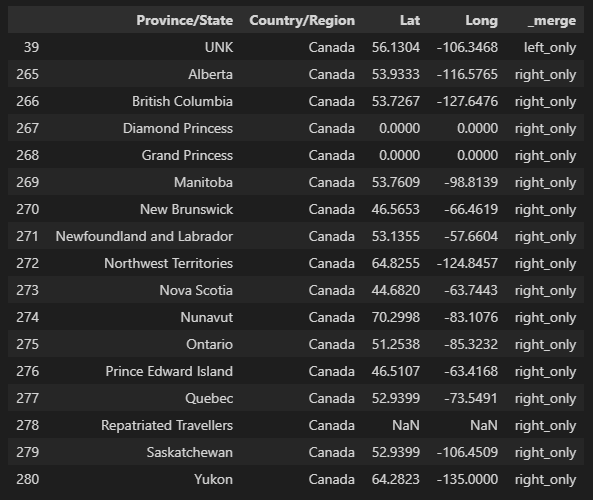
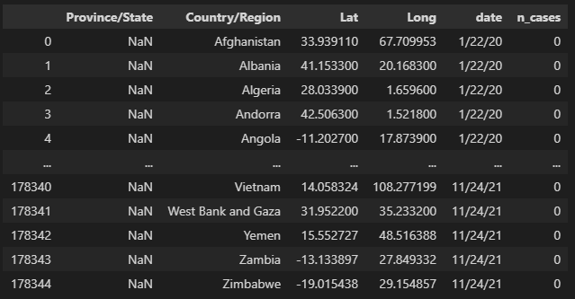
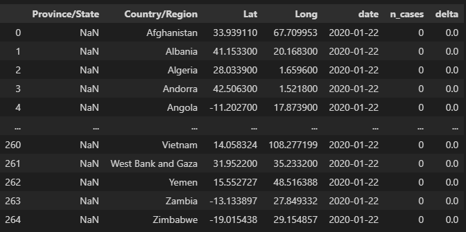
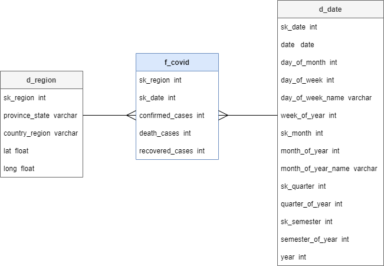

# ProductDev Covid

El siguiente proyecto contiene un análisis sobre los contagios, recuperacion y muertes generados por Covid19 según datos proporcionados por país y región.

---

## Docker

El siguiente docker-compose tiene como objetivo:

1. Crear contenedores y sus configuraciones para:

- airflow y postgres
- mysql
- streamlit

2. A manera de demo:

- Se definió el data.csv con datos simples id,name
- Se creó una base de datos dm_covid con una tabla covid y dos campos
- Se creó un DAG para leer data.csv y trasladarlos a la tabla dm_covid.covid
- Por medio de streamlite se consulta a la bd y se visualizan los datos.

### Configurando infraestructura

- `docker-compose build`
- `docker-compose up`

### Ejecutando dags

1. Ir a <http://localhost:8080/>
2. Encender DAG: data_ingestion_dag y automáticamente se ejecutará.
3. Refrescar para ver el avance de ejecución.

### Resultados en Streamlit

1. Ir a <http://localhost:8501/>
2. Se podrán visualizar los datos de Mysql cargados vía DAG en airflow

### Infraestructura

### Evidencia de funcionamiento

---

## EDA

La tarea de exploración del set de datos se puede observar en el jupyter notebook [EDA](https://github.com/CarlosGarlem/productdev_covid/blob/main/EDA/EDA.ipynb).

Transformaciones realizadas a los datos crudos:

- Estandarizacion de Locaciones
  - 
- Conversion de la representacion de datos de una representacion ancha (fechas como columnas) a una represetacion larga (una columna fecha, un registro por valor de fecha diferente)
  - 
- Calculo de diferencia de casos para una locacion entre dias consecutivos.
  - 
- Estandarización de representacion de valores desconocidos (UNK).

---

## DataMart (DM)

Para manejar los datos se optó por trabajar en una arquitectura basada en diagrama estrella, cuyo diagrama es el siguiente:

Trabajar los datos de esta manera permitió elaborar un DataMart capaz de manejar las metrícas para los casos cnofirmados, fallecimientos y recuperaciones reportadas a partir de los diferentes niveles de granularidad proporcionados por las dimeniones de fechas y regiones. 

La definición de las tablas puede encontrarse en el archivo de definición de 