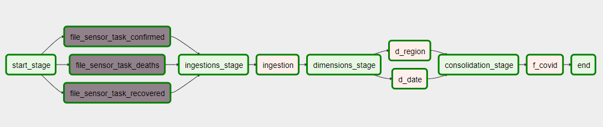

# ProductDev Covid

El siguiente proyecto contiene un análisis sobre los contagios, recuperacion y muertes generados por Covid19 según datos proporcionados por país y región.

---

## Docker

El siguiente docker-compose tiene como objetivo:

1. Crear contenedores y sus configuraciones para:

- airflow y postgres
- mysql
- streamlit

2. A manera de demo:

- Se definió el data.csv con datos simples id,name
- Se creó una base de datos dm_covid con una tabla covid y dos campos
- Se creó un DAG para leer data.csv y trasladarlos a la tabla dm_covid.covid
- Por medio de streamlite se consulta a la bd y se visualizan los datos.

### Configurando infraestructura

- `docker-compose build`
- `docker-compose up`

### Ejecutando dags

1. Ir a la interfaz de Airflow en la siguiente dirección y puerto <http://localhost:8080/>
2. Encender DAG: `data_ingestion_dag` y automáticamente se ejecutará.
3. Refrescar para ver el avance de ejecución.

**DAG**

La lógica del Dag está compuesta por 4 fases principales.
 
  1. **Start Stage**:
    Esta primera fase consta de 3 sensores uno por cada archivo de información, los sensores fueron configurados para chequear cada 10 segundos durante 10 minutos la existencia de un archivo en un directorio específico.

  2. **Ingestion Stage**:
    La fase de ingestión es ejecutada una vez los 3 sensores anteriores hayan encontrado los archivos específicos en el directorio. Por cada archivo se realizan una serie de transformaciones, como arreglos a coordenadas, trato de Nulos y transposición de los datos incluyendo su cálculo de casos en deltas. Finalmente cada archivo es insertado en una tabla específica de su tipo de dato. Estas tablas son `landing_recovered, landing_confirmed, landing_deaths`).

  3. **Dimensions Stage**:
    La fase de dimensiones realiza dos tareas, crear la dimensión de fechas a partir de extraer el rango de fechas de las 3 tablas de landing y la creación de la dimensión de regiones a través de seleccionar las regiones únicas de las 3 tablas de landing.

  4. **Consolidation Stage**:
    Una vez creadas las dimensiones necesarias, se procede a la creación y consolidación de la información en una tabla de hechos `f_covid` la cual estará consolidada por fecha y región, la cantidad de casos recuperados, confirmados y muertes.

### Resultados en Streamlit

1. Ir a <http://localhost:8501/>
2. Se podrán visualizar los datos de Mysql cargados vía DAG en airflow

### Infraestructura

### Evidencia de funcionamiento

---

## EDA

La tarea de exploración del set de datos se puede observar en el jupyter notebook [EDA](https://github.com/CarlosGarlem/productdev_covid/blob/main/EDA/EDA.ipynb).

Transformaciones realizadas a los datos crudos:

- Estandarizacion de Locaciones
  - 
- Conversion de la representacion de datos de una representacion ancha (fechas como columnas) a una represetacion larga (una columna fecha, un registro por valor de fecha diferente)
  - 
- Calculo de diferencia de casos para una locacion entre dias consecutivos.
  - 
- Estandarización de representacion de valores desconocidos (UNK).

---

## DataMart (DM)

Para manejar los datos se optó por trabajar en una arquitectura basada en diagrama estrella, cuyo diagrama es el siguiente:

Trabajar los datos de esta manera permitió elaborar un DataMart capaz de manejar las metrícas para los casos cnofirmados, fallecimientos y recuperaciones reportadas a partir de los diferentes niveles de granularidad proporcionados por las dimeniones de fechas y regiones. 

La definición de las tablas puede encontrarse en el archivo de definición de 

---

## Dashboard

El dashboard construido se presenta en streamlit y permite un análisis general de los datos recolectados con respecto a Covid-19, para ver los resultados ingresar a <http://localhost:8501/>

**Estructura**
- KPIs. Indicadores generales de las metrícas principales (casos confirmados, casos recuperados y fallecimientos)
- Mapa de calor. El mapa de calor se basa en los casos confirmados, y presenta un resumen de las estadísticas de las 3 métricas en el tooltip.
- Tabla. Contiene información de los países y sus métricas según lo seleccionado. 
- Diagrama de línea. Contiene información sobre los datos acumulados para cada una de las métricas según el país o región seleccionada. 
- Filtros. Los filtros disponibles permiten seleccionar el país o región a evaluar, por defecto seleccionado todos para reflejar las estadísticas a nivel mundial. Adicionalmente se dispone de filtros para seleccionar los períodos de inicio y fin a evaluar.

(img/Dashboard1.png)
(img/Dashboard2.png)